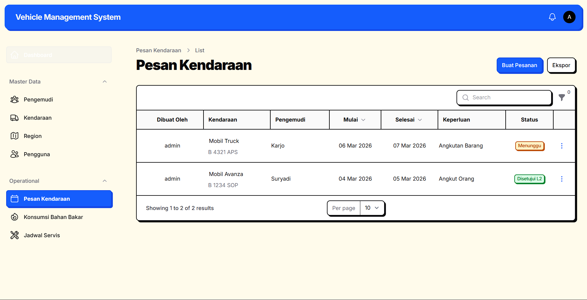
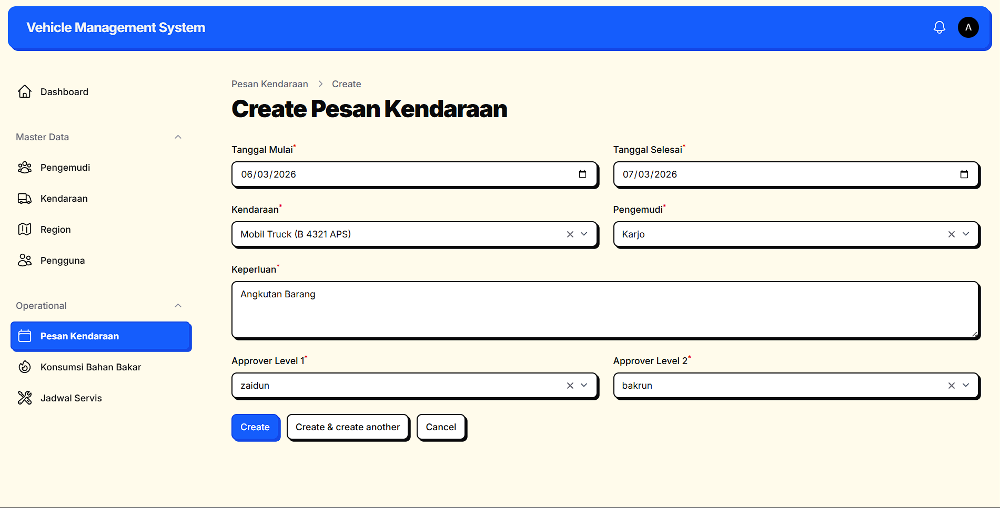
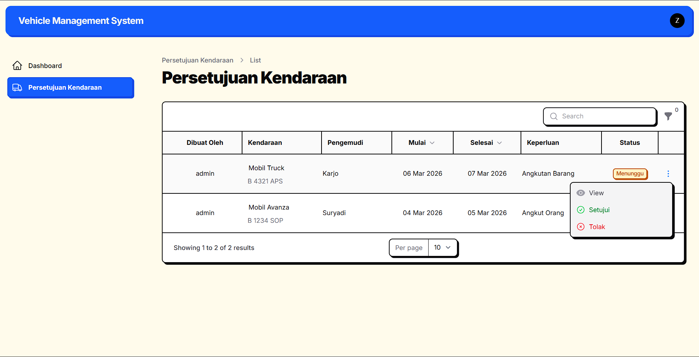
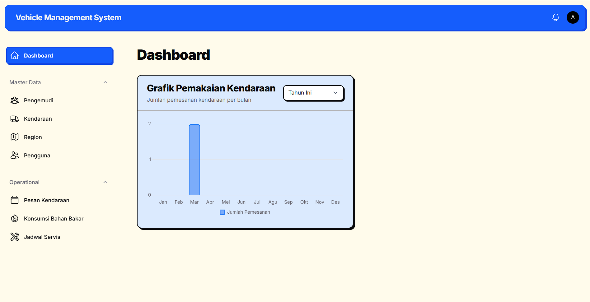
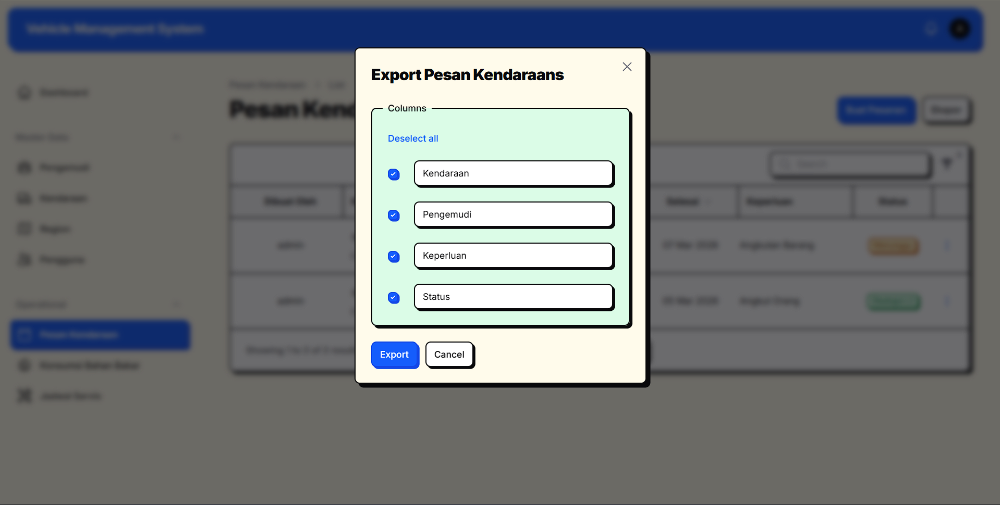
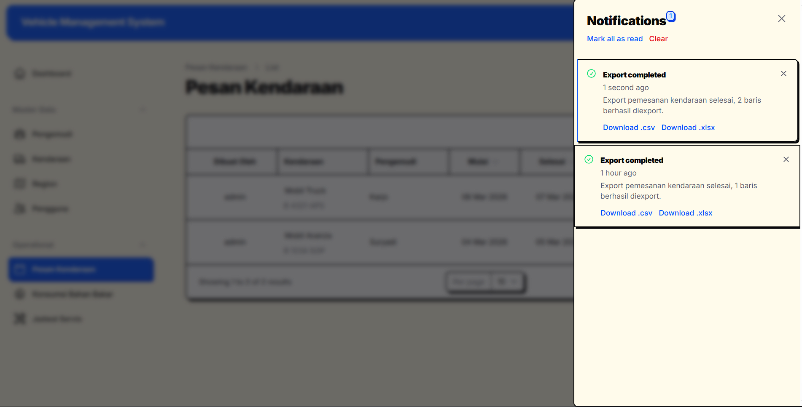
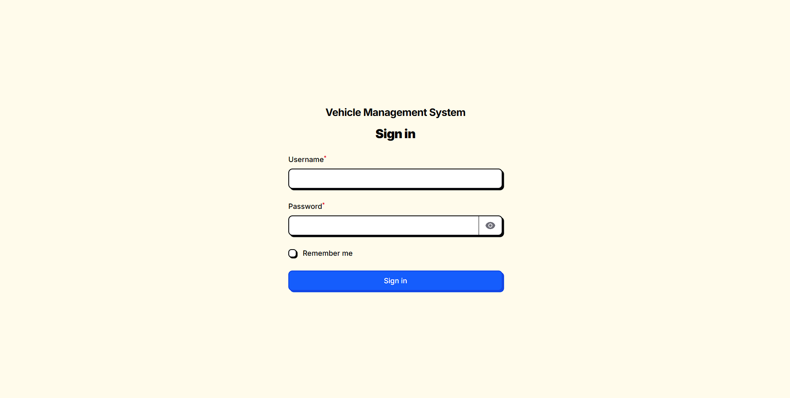

# Vehicle Management System (VMS)

Vehicle Management System (VMS) adalah aplikasi berbasis web yang dirancang khusus untuk memanajemen aset operasional perusahaan berupa kendaraan dinas. Aplikasi ini dibangun untuk mendigitalisasi, memonitor, dan mengefisienkan seluruh siklus peminjaman kendaraan, log bahan bakar, hingga riwayat servis pemeliharaan kendaraan.

### 🌟 Manfaat Utama
- **Efisiensi Alur Peminjaman**: Menggantikan proses manual pemesanan kendaraan menjadi terpusat dengan sistem persetujuan dua jenjang (L1 & L2) yang transparan.
- **Pencegahan Bentrok Jadwal**: Sistem secara cerdas mendeteksi dan mencegah pemesanan kendaraan atau driver yang jadualnya tumpang tindih (*conflict prevention*).
- **Akuntabilitas & Keamanan Data**: Segala jenis pembaharuan status/persetujuan direkam otomatis, dan *role-based access* menjamin hanya pihak berwenang yang dapat mengubah data master.
- **Monitoring Visual**: Dashboard memuat laporan pemakaian kendaraan interaktif dalam bentuk grafik periodik.

### ⚙️ Teknologi yang Digunakan
Aplikasi ini dikembangkan di atas arsitektur TALL Stack terkini dengan spesifikasi:
- **PHP** v8.4+
- **Laravel Framework** v12.x
- **Filament PHP** v5 (Admin Panel & TALL Stack abstraction)
- **Livewire** v3.x
- **Tailwind CSS** v3/v4 (Custom styling)
- **MySQL / Relational Database**

---

## 🚀 Langkah Instalasi (Local Development)

Ikuti langkah-langkah di bawah ini untuk menjalankan aplikasi VMS di mesin *local* Anda:

1. **Clone Repository ini**
   ```bash
   git clone https://github.com/Dunaman10/vms.git
   cd vms
   ```

2. **Install Dependensi Composer & NPM**
   ```bash
   composer install
   npm install
   npm run build
   ```

3. **Konfigurasi Environment Database**
   Salin file `.env.example` menjadi `.env`:
   ```bash
   cp .env.example .env
   ```
   Buka file `.env` di text editor dan sesuaikan kredensial koneksi ke database Anda. Pastikan database yang dituju benar-benar sudah ada / dibuat di MySQL (misal bernama `db_vms`):
   ```env
   DB_CONNECTION=mysql
   DB_HOST=127.0.0.1
   DB_PORT=3306
   DB_DATABASE=db_vms       <- Sesuaikan
   DB_USERNAME=root         <- Sesuaikan
   DB_PASSWORD=             <- Sesuaikan
   ```

4. **Generate Application Key**
   ```bash
   php artisan key:generate
   ```

5. **Jalankan Instalasi Node Storage & Database**
   Sebagai opsi termudah untuk memuat struktur tabel beserta isian datanya yang utuh, Anda bisa me-restoren atau mengimpor file backup SQL ke database Anda. File database yang bisa digunakan ada di dalam folder: `database/db_vms.sql`.
   *Alternatif:* Jika ingin men-generate struktur dari awal, silakan jalankan perintah migrasi & seed:
   ```bash
   php artisan storage:link
   php artisan migrate --seed
   ```

6. **Jalankan Aplikasi**
   Jika menggunakan Laragon/XAMPP, jalankan server pengembangan bawaan Laravel. Jika menggunakan Laravel Herd, web otomatis dapat di akses melalui `http://vms.test` atau sesuai nama foldernya.
   ```bash
   php artisan serve
   ```

---

## 🗄️ Relasi Database (ERD)

  
*(Bagan relasi tabel utama dalam sistem)*

Sistem ini didukung oleh **6 Main Entities** yang memiliki *relation mapping* yang saling tergantung:
- **`vehicles` & `drivers`**: Menyimpan master data mobil dinas beserta supirnya. Memiliki relasi log kegiatan operasional dengan (`fuel_logs` dan `service_logs`).
- **`users`**: Menampung Autentikasi dan Relasi Level Role (Admin & Approver L1/L2)
- **`regions`**: Relasi struktur yang mencatat area operasional kendaraan atau lokasi unit/user.
- **`bookings`**: Titik tengah Pivot (Jantung Aplikasi). Mengikat `vehicle_id`, `driver_id`, pembuat pesanan (`admin_id`), serta Pihak Penyetuju (`approved_l1_id`, `approved_l2_id`).
- **`booking_approvals`**: Tabel terpisah yang bertugas merekam histori dan *logs* aksi ketika seorang Approver melakukan *Approve/Reject* beserta catatannya, dengan relasi ke `booking` dan `user`.

---

## 📸 Fitur dan Akses Aplikasi

### Alur Utama Pemesanan 
Aplikasi mematuhi prosedur operasional di bawah ini:
1. **Terdapat 2 Jenis User**: Portal disesuaikan untuk tipe akses spesifik, yaitu *Admin* dan *Pihak Penyetuju (Approver)*.
2. **Input Admin vs Approver**: Admin ditugaskan untuk menginput pesanan kendaraan, lokasi, kendaraan, supir, serta *menentukan* siapa sajakah atasan berwenang (Pihak Penyetuju L1 & L2) yang merestui pemesanan tersebut.  
     
   
3. **Persetujuan Berjenjang (Minimal 2 Level)**: Atasan "Level 1" diwajibkan menyetujui, lalu antreannya akan diteruskan secara hirarkis ke atasan "Level 2".
4. **Persetujuan Langsung via Aplikasi**: *Approvers* (Pihak Penyetuju) dapat langsung menyetujui di dalam aplikasi secara efisien.  
   
5. **Dashboard Grafik Pemakaian**: Admin & Approver memiliki diagram *Bar Chart* analitik pemakaian bulanan kendaraan di dashboard mereka.  
   
6. **Laporan Periodik (Eksport Excel)**: Admin dapat memfilter tampilan Booking secara periodik (Dari & Sampai tanggal) dan mengekspor datanya ke dalam format Excel.  
   
   

### 🔑 Akses Login Simulasi (Seeder Default)

Seluruh User **login melalui gerbang pintu utama (`/auth`)**. Sesudah login, sistem akan otomatis melakukan *Smart Redirect* ke dashboard khusus (Admin panel atau Approver Panel) sesuai hak ases akunnya.



| Peran (Role) | Username | Password |
| :--- | :--- | :--- |
| **Admin** | `admin` | `password` |
| **Approver (Level 1)** | `zaidun` | `password` |
| **Approver (Level 2)** | `bakrun` | `password` |

> *Akses login via `http://localhost:8000/auth` (php artisan serve) atau `http://vms.test` (Laravel Herd)*

